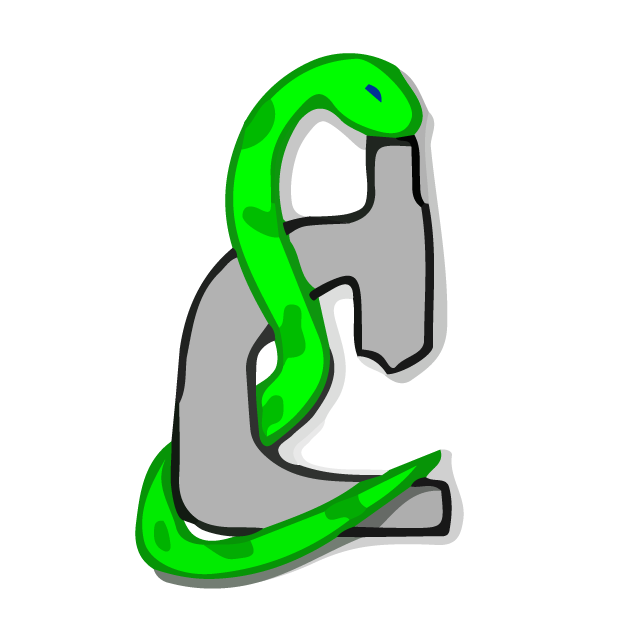

#  The PYthon Microscopy Environment

PYME (the PYthon Microscopy Environment) is an open-source application suite for light microscopy acquisition, data storage, visualization, and analysis. It offers a particularly comprehensive set of features for single-molecule localization techniques (PALM, STORM, PAINT, etc ...), but also supports many other modalities. The package is multi-platform, running on Windows, Linux, and OSX.

<!--  -->
<!--
-->

- **Website:** https://www.python-microscopy.org
- **Installation:** https://python-microscopy.org/doc/Installation/Installation.html
- **Documentation:** https://python-microscopy.org/doc/
- **Source code:** https://github.com/python-microscopy/python-microscopy/
- **Contributing:** https://python-microscopy.org/doc/Contributing.html
- **Bug reports:** https://github.com/python-microscopy/python-microscopy/issues

The documentation is also available in the *docs* subdirectory of the repository.

**Have a question?** Get in touch! \
You can email us at support@python-microscopy.org, or raise a [support issue](https://github.com/python-microscopy/python-microscopy/issues/new?assignees=&labels=support&template=support.md&title=%5BSUPPORT%5D). We are also active on the [image.sc forum](https://forum.image.sc/) - tag your post with `pyme` and we'll be happy to support you.
