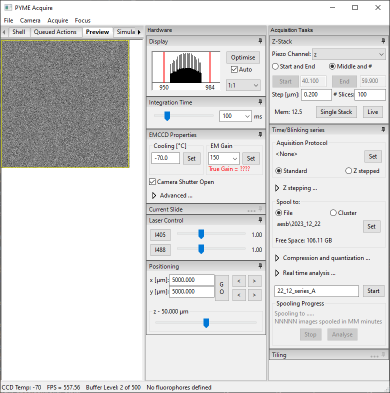

Using PYME Acquire
******************

User interface
==============
The PYME graphical user interface (GUI) is shown below. 

The GUI is divided into a live-preview window (left) and two vertical control panels (right) for hardware
controls and acquisition task controls. The console (for programmatic access) is available
in the :guilabel:`Shell` tab on the left. The left side of the GUI can be split to view multiple tabs simultaneously by clicking-and-dragging
on the tabs. The hardware and acquisition panel sections can be folded or pinned-open by clicking the title bar or pin icon, respectively.
The sections which appear in these panels are controlled by the initialization file (see :ref:`configuringpymeacquire`).
The acquisition task panel includes a :guilabel:`Z-Stack` section for :ref:`single z-stack acquisition <single_zstacks>`, and a 
:guilabel:`Time/Blinking` section for streaming data to disk (or server) and using :ref:`acquisition protocols <protocols>` (see :ref:`spooling`).
 

The camera & preview
====================

PYMEAquire will start with the camera running in a continuous live preview mode. The mapping
of the (high bit depth) camera data to the display is controlled by the display widget.
By default this auto-scales the available dynamic range  (max value - min value)
in the image to 8 bits for display. This auto-scaling behaviour can be disabled by
unchecking the **Auto** option. When auto-scaling is disabled, the scaling can be
adjusted by dragging the red reference lines on the histogram, right-clicking to 
edit the range as text, or by clicking
**Optimise** to achieve a min-max scaling once for the current frame. For historical reasons this
display assumes a maximum camera dynamic range of 12 bits and with cameras possesing
a higher dynamic range it is possible to saturate the display before the camera
saturates. The display widget also allows the display magnification to be changed.

Integration time
++++++++++++++++++++

The camera integration (exposure) time can be set using the integration time slider or the 
accompanying combobox.

Region of interest
++++++++++++++++++

A region of interest can be selected by using the mouse to select an area in the
preview window and then selecting :menuselection:`Controls-->Camera-->Set ROI` from the menu,
or by using the ascociated keyboard shortcut (**F8**). The ROI can then be cleared
through the menu, or by pressing **F8** again.

Advanced camera properties
++++++++++++++++++++++++++

Some cameras (eg the Andor EMCCDs) will cause an additional pane of advanced
settings to be shown which allow, for example, the EM gain end TE cooling temperature
to be set. A not completely obvious aspect of the acquisition software is that it
will run the camera in *continuous* mode (ie letting the camera acquire frames one
after the other and stream them into a buffer). This has the advantage of allowing
the higest possible frame rates, but means that the camera frames and any hardware
actions are essentially asynchronous. If syncronised motion is required, the camera
can be placed into *single shot* mode whereby control returns to the software after
each frame. For the Andor camera, this is achieved in the **Advanced** section of the
EMCCD controls. This is probably advisable when doing, for example, conventional
:ref:`single z-stacks <single_zstacks>`. Z-stacks in protocols avoid the syncronisation problem by recording a
timestamp of when the movement occured and calculating, post-hoc, which frame it
corresponds to.

Multiple camera support
+++++++++++++++++++++++

PYMEAcquire has some basic support for multiple cameras. If multiple cameras are
defined in the initialisation file, a control will be shown permitting switching
between the cameras.
For simultaneous multi-camera operation, such as using additional cameras for 
focus-locking or detecting additional color channels, multiple instances of 
PYMEAcquire can be run using separate initialization files. Synchronization 
can then be achieved using server interfaces 
(see :py:class:`PYME.Acquire.acquire_server.AcquireHTTPServer`). 
Please feel free to get in touch for support in setting this up for your application.

Acquiring data
==============

Acquiring single images
+++++++++++++++++++++++

Single images (snapshots) may be acquired by either selecting :menuselection:`Acquire-->Snapshot`
or by pressing **F5**. These can be saved as ``.tif``, ``.h5``, and other formats (see :ref:`DataFormats`).

.. _single_zstacks:

Single Z-Stacks
+++++++++++++++

3D image stacks such as used for conventional widefield microscopy and, for example
PSF measurements can be obtained using the control at top right. Again, the options are ``.tif``, ``.h5``, and other formats (see :ref:`DataFormats`).

.. _spooling:

Streaming/Spooling
++++++++++++++++++

The :guilabel:`Time/Blinking` section of the acquisition panel contains controls for
acquiring image series. 
An :ref:`acquisition protocol <Protocols>` can be selected by pressing :guilabel:`Set`
to follow a pre-defined acquisition sequence, while acquisition without a protocol selected
will simply start saving camera frames (leaving laser shutters and other settings in their
current state).
Selection of :guilabel:`Standard` or :guilabel:`Z stepped` buttons determines whether the 
focus position should be stepped during the acquisition.
The :guilabel:`Z stepping...` expandable arrow exposes controls for setting the z-stepping
range and step-size.

The :guilabel:`Spool to:` section displays the directory image series will be saved to, which 
can be changed by clicking `Set`. 
Series can be saved directly to disk in ``.h5`` format by selecting :guilabel:`File`, or streamed 
to a (local) server process by selecting :guilabel:`Cluster`.
While spooling to file is the most straightforward, spooling to the :ref:`cluster <PYMECluster>`
can enable significantly higher frame rates and lower-latency real-time analysis.
Spooling to the cluster requires that the :ref:`PYMECluster` server is running.
Cluster spooling will save the image series either as a single ``.h5`` file 
(:guilabel:`Spool to h5 on cluster` checkbox selected) or as a directory of ``.pzf`` PYME zip format files (one file per frame).
Spooling to a single h5 format is typically more convenient when running the cluster locally ('cluster of one')
on the same computer as PYMEAcquire, while spooling to ``.pzf`` files is the higher bandwidth option
when running a cluster copmrised of several computers.
Note that when spooling to cluster, the data will be saved under the dataserver root directory (see the :py:mod:`PYME.config` module).

Compression is enabled by default, and is compatible with either spooling mode (file or cluster).
The default compression is loss-less, meaning the data is not altered but the file size is reduced.
The :guilabel:`Quantization` checkbox toggles whether the camera counts (ADUs) are re-quantized
using a square-root scaling before compression - this option is lossy! 
Given that cameras digitize pixel intensity voltages using a linear scaling, but Poisson noise scales 
with the square-root of the intensity, this 'quantized' compression can significantly reduce the number
of unique values present in an image, significantly improving the compression factor without having a 
practical effect on the information content. This quantized compression is described in more detail 
`here <https://doi.org/10.1038/s41587-023-01702-1>`_ (`preprint <https://doi.org/10.1101/606954>`_), and 
requires camera noise properties to be present in the metadata.
The :guilabel:`Quantization scale` factor is in units of expected Poisson noise (standard deviation) at each pixel (:guilabel:`Scale`
factors below 1 therefore result in pixel intensity changes below the noise floor).
The :guilabel:`Quantization offset` should typically be left as 'auto' which will subtract the analog-digital offset
before re-quantizing.

The image series filename can be set in the text box next to the :guilabel:`Start` button. 
The :guilabel:`Start` button begins the acquisition.
