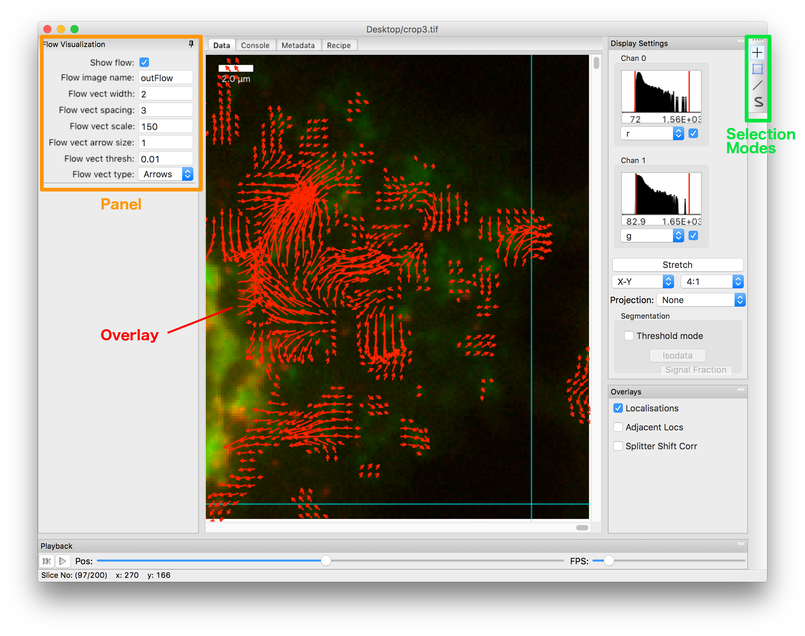

.. _extendingdsviewer:

Extending the image data viewer (PYMEImage/dh5view/View3D)
**********************************************************

The PYME image data viewer is implemented in :class:`PYME.DSView.dsviewer.DSViewFrame` and can be invoked either by running ``dh5view``
from the command line, or by importing and calling :func:`PYME.DSView.View3D <PYME.DSView.dsviewer.View3D>` or
:func:`PYME.DSView.ViewIm3D <PYME.DSView.dsviewer.ViewIm3D>` from within
python code [#needwx]_. Most of the viewers image processing functionality is accomplished by plugins, and this guide
will focus on writing new plugins.

.. note::

    dsviewer plugins, as described here, typically operate on a single image, require user interaction, and are not
    easily automated. If coding some image processing functionality which could be sensible to apply in an automated, or
    'batch' mode, please consider :ref:`writingrecipemodules` instead, and then optionally `wrapping a recipe module`_
    with a thin plugin.

Plugin Introduction
===================

``dsviewer`` plugins are python files which are located in the ``PYME.DSView.modules`` directory. Any file that
is located in within that directory will be automatically detected and treated as a plugin.

.. note::

    ``PYME.DSView.modules`` and ``PYMEnf.DSView.modules`` [#pymenf]_ are currently the only locations where modules will be detected.
    A more flexible mechanism of module discovery is high on the TODO list.

Plugins **must** implement a function called ``Plug(dsviewer)`` which takes an instance of the current
:class:`PYME.DSView.dsviewer.DSViewFrame`, and can implement any additional python logic. It is good practice not to put
too much processing logic in the plugin itself [#pluginmvc]_. A typical ``Plug()`` method instantiates a class which stores
plugin state, keeps a reference to the ``DSViewFrame`` object, and either adds menu items for it's functions, or registers
callbacks for overlays or GUI panels.

Adding menu items
-----------------

Most simple plugins will want to add one or more menu items. :class:`DSViewFrame <PYME.DSView.dsviewer.DSViewFrame>` provides a
helper function, :meth:`DSViewFrame.AddMenuItem() <PYME.ui.AUIFrame.AUIFrame.AddMenuItem>` to do this.

Wrapping a recipe module
------------------------

The easiest, most flexible, and recommended way of writing a plugin is to wrap an existing or new recipe module. For
modules derived from :class:`PYME.recipes.base.Filter` (most modules which transform a single input image into a single
output image) already have much of the necessary code implemented and the wrapping is simply as matter of registering
the modules :meth:`dsviewer_plugin_callback <PYME.recipes.base.Filter.dsviewer_plugin_callback>` function to a menu
item: ::

    def Plug(dsviewer):
        from PYME.recipes.XXX import YYY
        dsviewer.AddMenuItem(menuName='Processing', itemName='Do Stuff', itemCallback = lambda e : YYY.dsviewer_plugin_callback(dsviewer))

Somewhat more complicated wrappings can build on the template below (which more or less captures the internals of
:meth:`dsviewer_plugin_callback <PYME.recipes.base.Filter.dsviewer_plugin_callback>`: ::

    def DoStuff(image, parentWindow=None, glCanvas=None):
        from PYME.recipes.XXX import YYY
        from PYME.DSView import ViewIm3D

        mod = YYY(inputName='input', outputName='output')
        if mod.configure_traits(kind='modal'):
            namespace = {'input' : image}
            mod.execute(namespace)

            #Open the result in a new window. Setting the parent and glCanvas options keeps the UI happy
            #The glCanvas option enables the viewer to synchronize zooming and panning with the VisGUI point display if
            #both are running in the same process.
            ViewIm3D(namespace['output'], parent=parentWindow, glCanvas=glCanvas)

    def Plug(dsviewer):
        dsviewer.AddMenuItem(menuName='Processing', itemName='Do Stuff', callback = lambda e : DoStuff(dsviewer.image, dsviewer, dsviewer.glCanvas))

More complex and legacy plugins
===============================

Very few existing plugins follow the above pattern (mostly for historical reasons), and although new plugins are
encouraged to implement and wrap recipes, there will be times when this doesn't quite fit. Anything which requires
significant GUI interaction (e.g. annotation of images, creation of overlays, etc ... will most certainly not fit the
recipe module pattern. As such here's a brief outline of what is exposed and what you can do. To fully understand the
options, some examination of the code and existing modules is likely to be needed.

A :class:`PYME.DSView.dsviewer.DSViewFrame` instance exposes three important
attributes:

#. ``dsviewer.image`` : A reference to the currently displayed :ref:`ImageStack <datamodel>` object.
#. ``dsviewer.do`` : A reference to a :class:`PYME.DSView.displayOptions.DisplayOpts` instance which stores the display
   settings for the current image. This is useful for determining the current position in the stack, for extracting
   manual threshold levels, and for setting overlays.
#. ``dsviewer.view`` : A reference to the current view class (not commonly used).

A quick overview of the GUI components that plugins can alter in addition to menus is given below.

    An example of a panel and overlay generated by a plugin (in this case :mod:`PYME.DSView.modules.flowView`).

Panels
------

One way of adding GUI functionality is to add 'panels' to the left side of the image view.

.. warning::

    The interface for adding panels is currently pretty atrocious, and requires you to know more about the inner workings
    of wxpython and DSViewFrame than you probably want to. Some of the worst aspects will hopefully be refactored out at some point in the
    future, but for now, *here be dragons*.

Adding panels is accomplished by registering a callback that is called on window creation (and when new modules are loaded)
which generates the panel.

* Callbacks are registered by appending the callback function to :attr:`DSViewFrame.paneHooks <PYME.DSView.dsviewer.DSViewFrame.paneHooks>`
* The callback will receive an instance of :class:`PYME.ui.autoFoldPanel.foldPanel`
* The callback should generate an instance of :class:`PYME.ui.autoFoldPanel.foldingPane` and add it to the fold panel

An example (abbreviated/adapted from :mod:`PYME.DSView.modules.particleTracking`) is given below: ::

    import wx
    from traits.api import HasTraits, Int, Bool

    class StuffDoer(HasTraits):
        someProperty = Int(7)
        anotherProperty = Bool(False)

        def __init__(self, dsviewer):
            HasTraits.__init__(self)
            dsviewer.paneHooks.append(self.GenStuffPanel) # this registers this panel

        def GenStuffPanel(self, _pnl):
            # this function will be called on window creation and whenever the side panel is rebuilt (e.g. when a new module is loaded)
            item = afp.foldingPane(_pnl, -1, caption="Stuff Settings", pinned = True)

            pan = self.edit_traits(parent=item, kind='panel')
            item.AddNewElement(pan.control)

            bDoStuff = wx.Button(item, -1, 'Do Stuff')
            bDoStuff.Bind(wx.EVT_BUTTON, self.OnDoStuff)
            item.AddNewElement(bDoStuff)

            _pnl.AddPane(item)

    def Plug(dsviewer):
        dsviewer.stuff_doer = StuffState(dsviewer)

When possible, using `Traits <http://code.enthought.com/projects/traits/documentation.php>`_ (as illustrated above) to generate the actual GUI, rather than hand-coding an interface in
wxpython will save a lot of pain.

Overlays
--------

The :class:`DSViewFrame` overlay system is a low level interface which allows plugins to draw overlays on top of the
currently displayed image. To use overlays you will have to get familiar with reasonably low level wxpython programming,
specifically operations on `wx.DC <https://wxpython.org/Phoenix/docs/html/wx.DC.html>`_ objects.

You need to:

#. Define a function with a signature matching ``DrawOverlays(view, dc)`` (or optionally ``DrawOverlays(self, view, dc)``
   if a class method).
#. Register this function by appending it to the overlays list in the
   :class:`display options <PYME.DSView.displayOptions.DisplayOptions>`, e.g. ``dsviewer.do.overlays.append(DrawOverlays)``

The two parameters are the ``view`` object (an instance of :class:`PYME.DSView.arrayViewPanel.ArrayViewPanel`) and the
`wx.DC <https://wxpython.org/Phoenix/docs/html/wx.DC.html>`_ instance the overlay should be drawn to. The ``view``
object is mainly useful as it provides a number of functions for mapping pixel co-ordinates to screen co-ordinates and
vice-versa.

These are:

* :meth:`~PYME.DSView.arrayViewPanel.ArrayViewPanel._ScreenToAbsCoordinates`
* :meth:`~PYME.DSView.arrayViewPanel.ArrayViewPanel._AbsToScreenCoordinates`
* :meth:`~PYME.DSView.arrayViewPanel.ArrayViewPanel._PixelToScreenCoordinates`
* :meth:`~PYME.DSView.arrayViewPanel.ArrayViewPanel._PixelToScreenCoordinates3D`
* :meth:`~PYME.DSView.arrayViewPanel.ArrayViewPanel._drawBoxPixelCoords`

.. warning::

    The overlays mechanism needs a lot of work, including but not limited to removing the leading underscores from the
    co-ordinate transformation functions (these were initially written for class internal use, but have proved very
    outside the class as well).

    At the moment, all overlay functions get called and it is up to the individual plugin to decide whether to display
    or not. On the TODO list is to add central control of overlay toggling and to change to using a
    registration function rather than appending to a list.

Selections
----------

dsviewer supports 4 selection modes: *point* |point|, *box* |box|, *straight line* |line|, and *curve* |squiggle|. Box and line selections are reasonably self
explanatory. Both cases are specified by two points, which either represent diagonally opposed corners of a box or
endpoints of a line. *Curve* selections are a freeform curve, stored as a series of (x,y) co-ordinates. Both line and
curve selections can have a width.

.. todo::

    expand this description.

.. rubric:: Footnotes

.. [#needwx] The program should be running a wxpython event loop. This will always be the case if called within one of
    the PYME GUI programs (dh5view, VisGUI, PYMEAcquire). If you want to call ``View3D`` or ``ViewIm3D`` from an ipython
    session you will need to run ``ipython --gui=wx`` to make sure the wx event loop is running. In an ipython/jupyter
    notebook you will need to use the ``%gui wx`` magic before running View3D.

    Running from an ipython notebook with anaconda on OSX requires some additional fiddling - you have to change
    the shebang of ``/PATH/TO/anaconda/bin/ipython`` to point to the framework copy of python (usually
    ``PATH/TO/anaconda/python.app/Contents/MacOS\python``) so that ipython notebooks can access the display without dying.

.. [#pymenf] PYMEnf is a module which is used internally within the Baddeley and Soeller groups and contains code that we
    cannot distribute due to licensing restrictions, contains sensitive information, or for some other reason is not
    ready for public release.

.. [#pluginmvc] Although the model-view-controller pattern is poorly followed in the majority of PYME code, it is
    useful to think of plugins existing at the controller level - providing the interface between image processing
    routines and libraries and the view code. That said, a lot of existing plugin code includes both GUI and program logic.

.. |point| image:: ../PYME/resources/icons/crosshairs.png

.. |squiggle| image:: ../PYME/resources/icons/squiggle_select.png