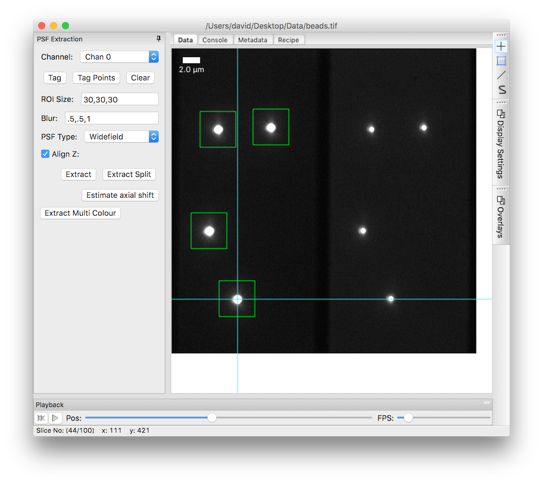
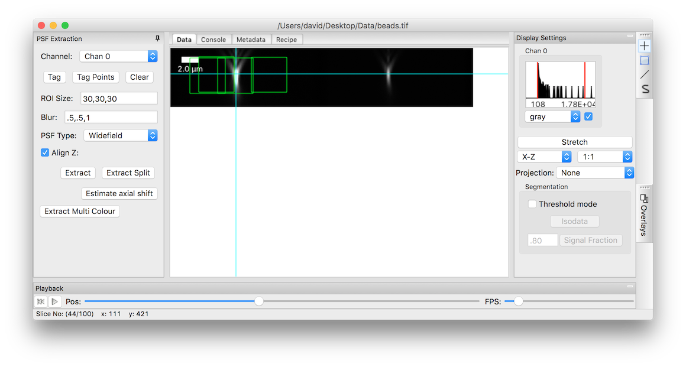
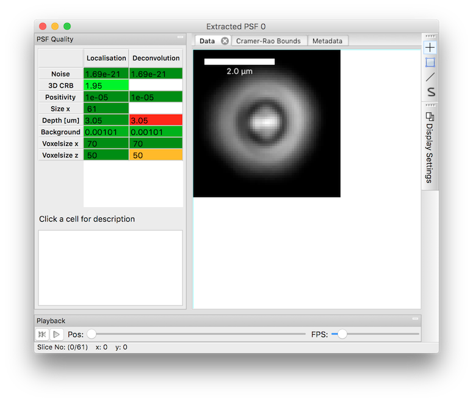

.. _psfextraction:

PSF Extraction
**************

PYME has a reasonably complete toolchain for extracting PSFs for use in either 3D localization fitting or deconvolution.
The process is very similar for both cases.

Single channel extraction
=========================

Step 1: Acquire a bead stack
----------------------------

Acquire a stack of bead images using the same objective, tube lens setting (if available) and excitation/emission channel
as your data and save as `.tif`. To get a good PSF, you should consider the following:

**Bead selection:** The bead size should be smaller (preferably much smaller) than the PSF width, but should also be
bright enough to give you good signal to noise. Ideally we'd use ~40 nm diameter beads but these tend to be too dim. In practice
we usually use 200 nm beads and correct for the bead size later (see FIXME).

**Bead density/spacing:** You want to spread beads on the coverslip such that several beads in the field of view (to permit averaging), but also want the beads to
be well separated (~ 60 pixels) from each other. This will likely require some trail and error with dilutions and also
selection of ROIs when performing the imaging. A good starting point is a dilution of 1:2000 for 200 nm dark red beads,
or 1:100 for tetra-speck beads.

**Illumination/Integration time:** We usually use the arc lamp for illumination as it gives us the largest usable field
of view and allows us to average more beads. To get a good PSF, you want high SNR. Choose the integration time and
illumination power to optimize this without clipping the signal in focus. We also tend to run somewhat slower so that we
minimize any motion artifacts from moving the focus.

**Axial step size:** For localization, we get good results with 50 nm axial steps. For deconvolution the PSF **must** be
Nyquist sampled in z and it doesn't hurt to slightly oversample. We typically use 200 nm steps.

**Stack z extent:** For localization this should span from ~ 2um below the focus to ~2 um above. For deconvolution,
~5 times the axial FWHM on either side of the focus is recommended. In either case, ~ 100 slices should be taken (by
default the extracted PSF size is 64 slices deep, and some allowance is needed for axial alignment of different beads).

Step 2: Load the bead stack in dh5view
--------------------------------------

Load the data in dh5view, if necessary using ImageJ to convert to a format that we can read (see :ref:`dataformats`). If
the data was not generated in PYME, set the voxelsize when prompted.

Step 3: Activate the PSF extraction mode
----------------------------------------

Choose `Modules->psfExtraction` from the dh5view menu. This should create a `PSF Extraction` panel to the right of your
data as seen in the folowing image:

.. figure:: images/psf_extraction_gui.png

    The PSF Extraction GUI

Step 4: Select beads to average
-------------------------------

Select the beads to use by clicking on the beads and pressing the `Tag` button. A green square should appear around each
bead image when you press Tag.

This square should automatically 'snap' to the centre of the selected bead, and is actually a 3D cube, as evidenced by
looking at the x-z projection.

If the boxes intersect the top or bottom of the xz view (generally only a problem if the stack is too small or poorly
centred), this will result in a somewhat cryptic error when it comes to the extraction step.

**Notes:**

* The size of the green boxes and the ROI to be extracted is controlled by the ROI Size box. This is a *half size*, and
  the actual size extracted will be 2*ROI Size + 1 (i.e. we go 30 pixels to the left of our centre and 30 pixels to the right).
* When tagging, you should try and avoid beads whose green boxes would overlap with those of other beads. These are too
  close and contributions from the neighbouring beads will corrupt the measurement
* You should also try and avoid beads which might be a cluster or aggregate (usually significantly brighter than individual
  beads)
* You can clear all tags with the `Clear` button

.. note::

    If you also enable the `blobFinding` module you can automatically find beads using a simple threshold and the
    `Object Finding` panel. Clicking `Find` will detect objects (marked with a small green square) and clicking `Tag Points`
    will tag each of the found objects. In practice we tend to tag points manually however as we can more easily reject
    beads which are too close or clustered.

Step 5: Perform the extraction
------------------------------

Clicking on `Extract` will take each tagged ROI, find the centre of the bead, and use sub-pixel Fourier shifting to align
and average all the ROIs. In addition to `ROI Size` there are 3 configurable parameters for the extraction:

**Blur:** We pass the extracted PSF through a Gaussian filter to reduce and residual noise. This is the filter sigmas in x, y, and z
respectively. The defaults are reasonable for most PSFs, but if you have a lot of averages (or another way of getting good SNR)
fit accuracy might be improved by reducing these (especially in z, x-y accuracy is relatively robust against oversize model PSF
widths).

**PSF Type:** This should probably be renamed and dictates whether to normalize the intensity across slices in z. If `PSF Type`
is `Widefield` we assume that the sum of intensity in the defocussed slices should be equal to that of the in focus slice
and normalize each slice to enforce this. If it's `Confocal`, no normalization is performed. Because this assumption
about intensity doesn't always hold (e.g. if there is clipping or apodization within the optical path) `Confocal` is
often the right choice even when doing widefield imaging. This is especially relevant for biplane and splitter fits which
might misbehave if there is is apodization and `Widefield` normalization is selected.

**Align Z:** This is only relevant when extracting multi-channel PSFs (see later).

Once you click on `Extract` you will get a new window which shows the extracted PSF

This has a number of sanity checks (on left hand side) which indicate potential problems with the PSF with traffic light
colours. Click on any of the cells to get a description of what the particular metric means. There is also a tab which lets
you look at the estimated CRLB for your extracted PSF and how it compares to a theoretical astigmatic case.

.. image:: images/extracted_PSF_CRLB.png

At this point you can save your PSF by choosing `File->Save As` or proceed to the next step

Step 6: Correcting for the bead size [optional]
-----------------------------------------------

Using finite size beads as a PSF estimate for either fitting or deconvolution has the disadvantage that the estimated PSF
will be larger than the true PSF. In deconvolution this can lead to artifacts whereby the image is 'overdeconvolved' and a
continuous structure broken up into a series of points. When performing localization an overly large PSF estimate will
typically result in reduced axial localization precision, and z-dependant bias / distortion in the fitted values.

One way to partially address this problem is to try and correct for the bead shape. We do this using deconvolution with
a twist. Rather than trying to estimate an unknown object from an image + PSF, we try and and estimate an unknown PSF from
image + a known object model (in this case a sphere matching the bead diameter). To correct for bead size choose
`Processing->Deconvolve bead shape` from the dh5view menu of your newly extracted PSF. Enter the correct bead diameter,
and click `OK`. You will get a new window with the deconvolved PSF which can be saved by choosing `File->Save As`.

Multi-Channel PSFs
==================

The PSF extraction tool has support for extracting PSFs from multiple channels simultaeneously, and for various different
ratiometric 3D fitting regimes. If a box or button is not described above it is likely related to multi-channel PSFS.

TODO - flesh out the details.

General Tips and Observations
=============================

* PSF sample preparation should match imaging sample preparation as closely as possible (i.e. same RI etc)
* New PSFs should be taken regularly (ideally at the start of each imaging session)
* If imaging with a TIRF objective and the sample RI does not closely match that of the immersion oil (or more specifically
  if the sample RI < the objective NA) there can be a significant super-critical angle fluorescence component in the PSF
  if beads on the coverslip are used. This has the potential to make the measured PSF a poor estimate of the true
  single molecule PSF if you are imaging more than ~500nm deep in the sample. We haven't fully quantified this, but there
  might be an argument for abandoning the conventional best practice of preparing beads on the coverslip and using beads
  prepared on the slide and imaged through a thin layer of medium instead.
