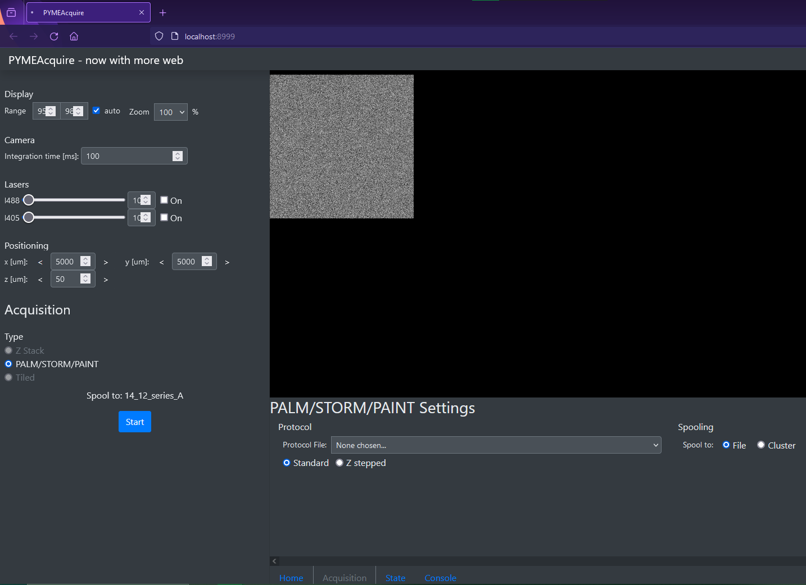

Using the PYMEAcquire Web Interface
***********************************

.. note::
    This interface is still under development and likely buggy! 
    Please report any issues you encounter, and feel free to
    get involved in developing this feature.

Many components of PYME have a server backend to support flexible task
and data distribution, as well as enable analysis-based feedback to 
control microscope acquisition. 

The PYMEAcquire server enables control of the microscope and acquisition
using a web interface. This is an alternative user interface to the default
WX-based PYMEAcquire. 

Setup
=====
The PYMEAcquire server has several dependencies which may not have been 
installed with PYME. These can be installed using conda (prefered) or pip.
You will likely need to install pyjwt, for example:
`conda install pyjwt`

Running
=======
To run the PYMEAcquire server, open your terminal, activate the appropriate
environment, and run `python -m PYME.Acquire.acquire_server`. By default,
this will open using simulated hardware. To change the initialization script,
use add `-i <path/to/your/init_script.py>` to the command.

The server will by default open a new browser tab (or window) and navigate to the
web interface.

    The web interface for PYMEAcquire. The left panel includes display options,
    camera, laser, and positioning settings, as well as the acquisition control.
    Tabs located at the bottom of the screen allow display of the scope state,
    and more acquisition settings, including selection of acquisition protocols.

