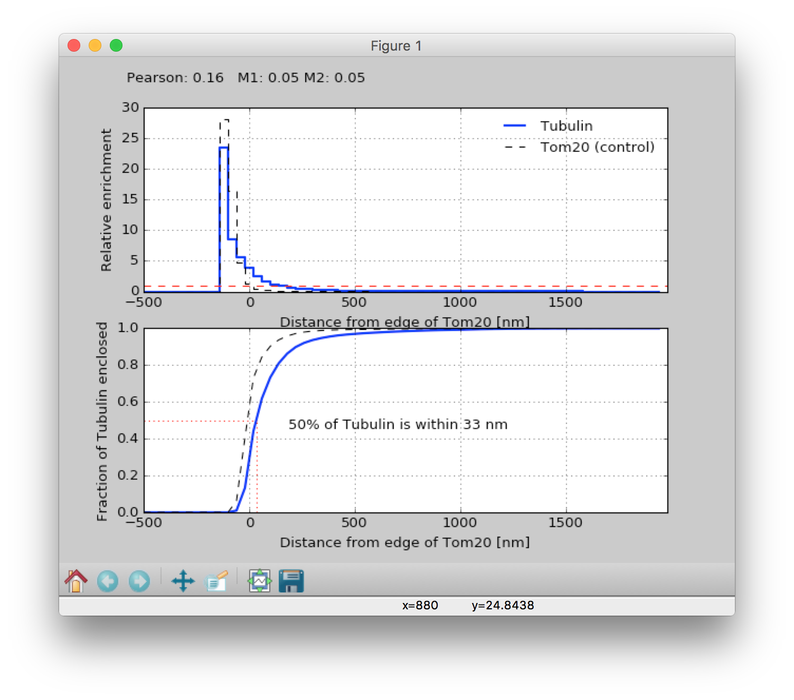
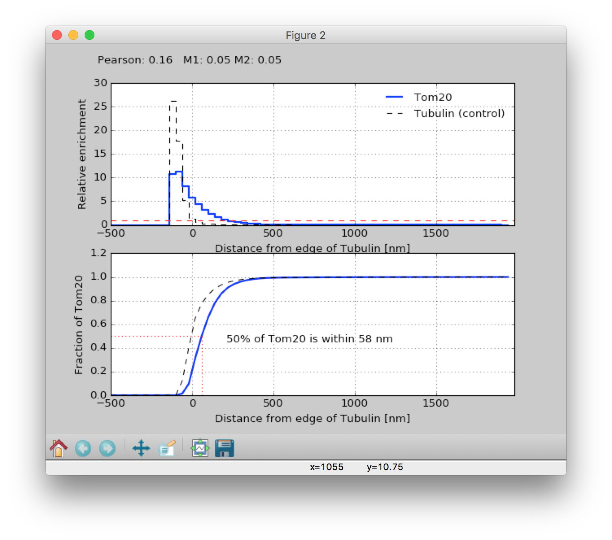

Distance transform colocalization HOWTO
=======================================

Loading data
------------

From the terminal (`cmd-space terminal` on OSX)

|image0|

run:

.. code-block:: bash

   pymeimage path/to/filename.tif

Alternatively, just run ``pymeimage`` without arguments and use the file open
dialog which is displayed to find and open your image. ``pymeimage`` should be
able to read anything that bioformats can, and a couple of extras.

The viewer
----------

You should get an image viewer like the one shown below. There is
currently support for 3 dimensions + colour, and the 3\ :sup:`rd`
dimension can be either time or Z (i.e. XYZC or XYTC). The red lines in
the histograms on the right adjust the display scaling. Clicking on one
of these histograms and pressing ‘m’ will scale that channel so that the
display stretches between the minimum and maximum value. Pressing ‘p’
will map the scaling to the 1\ :sup:`st` and 99\ :sup:`th` percentile of
the data. Pressing the ‘stretch’ button will map all channels min-max.
The dropdowns underneath the ‘stretch’ button select whether you are
viewing an XY, XZ, or YZ slice, and the scaling of the image. Dragging
the ‘Pos’ slider at the bottom of the image will set the current slice
in the stack.

|image1|

Loading the colocalization module
---------------------------------

``pymeimage`` doesn’t load all it’s modules at startup. To load the
colocalization module, choose `coloc` from the `Modules` menu.

Choosing thresholds
-------------------

The distance transform module uses a threshold on the reference channel
to determine what belongs to that channel and what doesn’t. Enable
threshold mode by checking the box towards the bottom of the display
settings panel. That should change the display to look like this.

|image2|

The double red lines get replaced with a single line which now
represents the threshold, and the display shows the thresholded masks.
The thresholds can either be set manually by dragging the lines, or by
using one of 2 automatic threshold algorithms, represented by the
`Isodata` and `Signal fraction` buttons. Isodata uses the standard
isodata algorithm, whereas signal fraction calculates the threshold that
would be needed to capture a given (default 80%) percentage of the
signal.

Performing the analysis
-----------------------

Once you are happy with the thresholds, choose `Processing->EDT
Colocalisation` from the menu. NB: this won’t show up unless you have
loaded the `coloc` module. You should get the dialog shown in the next
figure. You can choose which channel to use as a reference (1:sup:`st`
channel) and which to measure (2:sup:`nd` channel), as well as the bin
sizes for the histogram. If you have more than 2 channels, make sure you
pick the right ones.

|image3|

When you click OK, it will calculate a distance transform from the mask
of the first channel and measure the distribution of the (unthresholded)
second channel with respect to that mask. It then swaps the order, and
calculates the distribution of the first channel with respect to the
second channel's mask. **Note that if you have a stack (either 3D or time
series) ``pymeimage`` will assume it is a z-stack, and calculate distances in
3D**.

When calculations are complete, 3 windows will be displayed.

|image4|\ |image5|

|image6|

The first window shows the *relative enrichment* (comparing the density
to an assumption of uniform spatial randomness) of label B at a given
distance from label As mask (top panel), and the total fraction enclosed
at a given distance (bottom panel). Negative distances are inside the
mask, and Manders and Pearson coefficients are displayed at the top of
the figure. The *50% of X within Ynm* metric is my candidate for a new
colocalization metric which will still work for super-resolution methods
where nothing really colocalizes. The dotted line shows a comparison of
same analysis performed on the raw intensities in the channel used to 
generate the mask, and essentially 
functions as a control for how good the thresholding is. The second window 
is a repeat of the first with the labels switched, and the 3\ :sup:`rd` 
window just displays the raw histogram data. The 3\ :sup:`rd` window is 
mainly interesting if you want to access the raw histogram data, which can 
be saved in a format which can be imported into Excel by bring this window 
to the front and then selecting `File-> Save as` from the menu. **NOTE: when 
saving histograms you must set the `File type` in the Save as dialog to 
`Tab formatted text - .txt`.**

.. |image0| image:: media/image1.png
   :width: 6.50000in
   :height: 4.44792in
.. |image1| image:: media/image2.png
   :width: 6.50000in
   :height: 6.17222in
.. |image2| image:: media/image3.png
   :width: 6.50000in
   :height: 6.17222in
.. |image3| image:: media/image4.png
   :width: 6.50000in
   :height: 6.17222in

.. |image6| image:: media/image7.png
   :width: 3.68125in
   :height: 3.68125in
