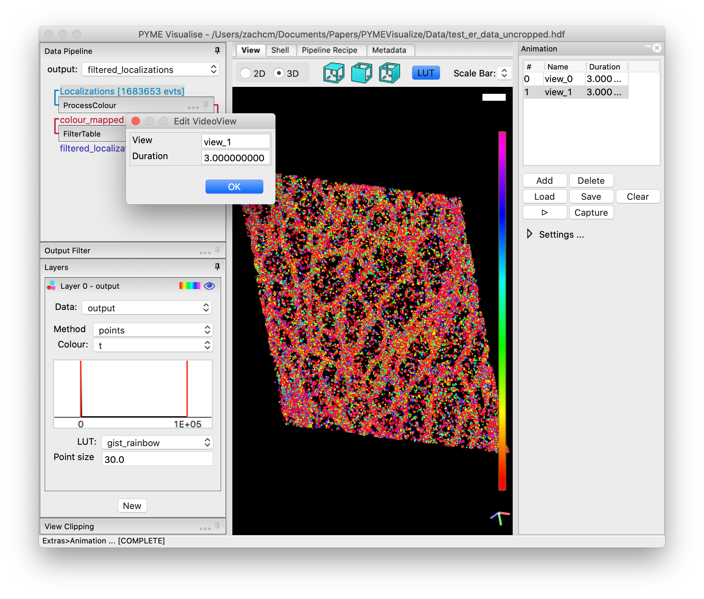

Animation
---------

Animations, such as point cloud fly-throughs, are generated from keyframes set by the user in the animation panel. The
animation panel is accessed by selecting :menuselection:`Extras-->Animation` from the PYMEVisualize menus.

A populated :guilabel:`Animation` pane is shown in :numref:`fig_animation`. Each row in the animation table represents a keyframe.
A keyframe marks the end of a transition in the animation. A keyframe is set by rotating, translating, or zooming the
data to have a desired look and then pressing :guilabel:`Add` in the :guilabel:`Animation` pane. Double-clicking on a row allows editing of
the keyframe name, which can be used as a unique descriptor, and duration, which edits the length of the transition from
the previous keyframe to this keyframe (note that the duration of the first keyframe is therefore a dummy variable).
Selecting a row and pressing :guilabel:`Delete` removes the selected keyframe from the animation. Keyframes can be saved and
loaded in a JSON format using :guilabel:`Save` and :guilabel:`Load`, respectively. All keyframes can be removed at once by pressing :guilabel:`Clear`.

When the :guilabel:`play` button is pressed, the animation will play in as a seamless transition through the keyframes in order.
If :guilabel:`Capture` is pressed, a dialog will pop up and the user will choose a folder in which to save this animation as a
series of image files. Expanding :guilabel:`Settings…` reveals a dropdown menu labeled :guilabel:`Export file type`, which allows the user
to change the file type of the images exported to JPEG, PNG, or TIFF.

    Actively editing an animation keyframe in PYMEVisualize. This shows an animation with two keyframes added by
    rotating the data and pressing :guilabel:`Add` at each desired rotation. The second keyframe has been double-clicked,
    revealing an :guilabel:`Edit VideoView` window, which allows the user to change the name of the keyframe and the
    duration of the transition from the previous keyframe to this keyframe.