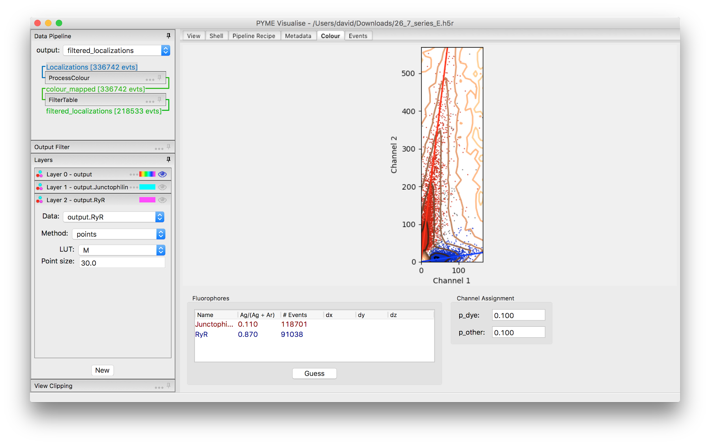
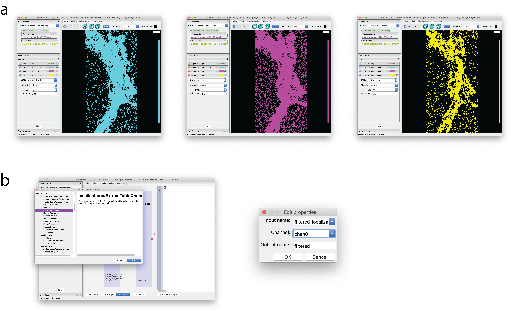

Appendix
--------

.. _sec_ratiometric:

Ratiometric colour settings
###########################

When processing ratiometric localisation data (having a ``gFrac`` column) the splitting ratios for each dye species can
either be set in the series metadata, or by using the :guilabel:`Colour` tab (:numref:`fig_ratiometric`). To add a labelling
right click in the :guilabel:`Fluorophores` list box and select :guilabel:`Add`. Enter a channel name and splitting ratio
in the dialog that opens. Alternatively click :guilabel:`Guess` to attempt to automatically detect the channels using the
K-means algorithm. Once added, you can click in the name or ratio columns to edit. The plot above is a scatter plot
showing a subset of all localisations and updates to show the resulting channel assignments.

Thresholds used in the Bayesian assignment process are adjustable in the :guilabel:`Channel Assignment` panel. A dye is
assigned to a given channel if both it's probability of belonging to that channel is greater than ``p_dye`` **and** it's
probability of belonging to any other channel is less than ``p_other``. The defaults assign fluorophores to the most likely
channel and ensure that the chance of a false assignment is less than 10%. We find they seldom need tweaking. If adjustment is
necessary, ``p_other``, which controls the rejection of potentially mis-assigned localisations, is most useful. It is tempting
to think that ``p_dye`` should be higher (i.e. we should have a high certainty that a dye belongs to a given channel), but
this would be a mistake - ``p_dye = 0.1`` will include 90% of the statistical spread of localisations belonging to that
channel. ``p_dye = 0.5`` by comparison would only capture 50% of a dye's statistical spread and would needlessly discard
a large fraction of the localisations.

    Ratiometric splitting in the :guilabel:`Colour` tab.

.. _sec_colour_isolation:

Isolating a single channel for processing
#########################################

To apply processing steps to a single channel (rather than to all channels at once), it needs to be isolated in the
pipeline. To do this, navigate to the :guilabel:`Pipeline Recipe` tab and select :guilabel:`Add Module`, as in :numref:`fig_color` b. Then select the
``ExtractTableChannel`` recipe from the **localisations** recipes and press :guilabel:`Add`. This will result in a
dialog box as shown in :numref:`fig_color` c, where here the first color channel, ``chan0``, is selected. Returning to
the :guilabel:`View` tab and selecting ``filtered`` as the :guilabel:`output` in the upper-left portion of the window
shows only the localizations present in the color channel ``chan0`` (:numref:`fig_color` a, bottom). Additional data
processing will only operate on this color channel as long as ``filtered`` is selected as the :guilabel:`output`.

    Visualization and color channel selection of 3-color super-resolution image of *cis*, *medial*, and *trans*-Golgi.
    (a) *Top*. All three color channels visualized in a single layer. (b). Selection of the ``ExtractTableChannel`` 
    recipe in the :guilabel:`Pipeline Recipe` tab and ``ExtractTableChannel`` dialog box, set to extract color channel 
    ``chan0`` from the original data.