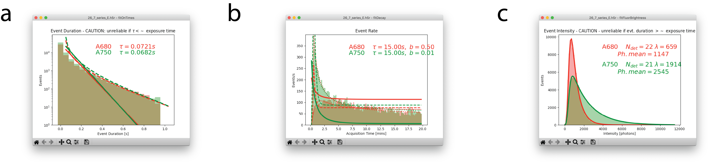

Data correction and quality control
-----------------------------------

.. _sec_chaining:

Chaining
########

A fluorophore that is on for multiple frames in the raw data will appear as a series of localizations at sequential
times. To group localizations close in space and time into single events, run
:menuselection:`Corrections-->Chaining-->Find consecutive appearances`. A dialog will appear allowing chaining options
to be set.

.. py:class:: FindClumps
    :noindex:

    :Clump radius: is the maximum spatial distance between chained localizations. The default is twice the
       localization's lateral fit error (a :math:`2\sigma` should correctly link 95% of localisations).

    :Time window: is the maximum temporal distance (in frames) allowed between chained localizations.

Pressing :guilabel:`OK` in the dialog will then identify which localizations are likely members of a chain, but will not
replace the members of the chain with a single grouped/averaged localisation. This is done in a separate step,
:menuselection:`Corrections-->Chaining-->Clump consecutive appearances`.

.. _sec_drift:

Drift correction
################

PYMEVisualise supports 3 forms of drift correction out of the box, with additional algorithms available as plugins. The
builtin methods are as follows:

:Fiducial based drift correction: This uses fiducials localised along with the blinking molecules to correct drift, and
    assumes that the fiducial localisations are present in a different dataset to the single molecule localisations (as
    optimal detection, background subtraction, and fitting settings are likely to be different for fiducials and molecules).
    If the data was analysed using PYME, both these datasets should be in the same file, and running fiducial based
    correction should be as simple as selecting :menuselection:`Extras-->Fiducials-->Correct` from the menu (and potentially
    entering the fiducial diameter to permit filters to be set accordingly). If fiducial and single molecule datasets are
    not in the same file, you will need to load the localisations first and then run
    :menuselection:`Extras-->Fiducials-->Load fiducial fits from 2nd file` to load the fiducial fits. The algorithm
    extracts fiducial traces, and aligns and averages the traces from multiple fiducials (weighted by localisation precision).
    It tolerates small gaps in the fiducial traces as long as not all fiducials traces are broken in the same frame.
    After correction is complete, :menuselection:`Extras-->Fiducials-->Display Correction Residuals`, will show the
    residuals (error between each fiducial and the average correction) which gives an indication of correction quality.

:Autocorrelation based drift correction: Accessed as :menuselection:`Corrections-->Autocorrelation based drift correction`,
    this is essentially an implementation of the algorithm described in the supplement of [huang2008]_, dividing the localizations into
    overlapping time blocks, and performing autocorrelation between those blocks.

:Transmitted light correction: This relies on drift measurements made during image acquisition using a
    transmitted light channel (see [mcgorty2013]_ - our implementation does not assume, however, that correction of x-y drift
    is necessarily performed in real-time, rather saving the recorded drift values along with the image data), and
    requires suitable drift *event* data in the input files.

.. _sec_frc:

Fourier Ring Correlation
########################

Fourier ring correlation (FRC) is an established technique for estimating the resolution of localization-based images
[nieuwenhuizen2013]_. To use FRC to estimate resolution in PYMEVisualize, first select
:menuselection:`Extras-->Split by time blocks for FRC`. The will create 2 fake colour channels, ``block0`` and ``block1``,
based on dividing localisations in time with a temporal block size set using the dialog in :numref:`fig_frc` a (for
multicolour data it will split the existing color channels in 2 so you will get double the number of colour channels,
e.g. ``chan0_block0``, ``chan0_block1``, ``chan1_block0``, ``chan1_block1``).

Render images by choosing :menuselection:`Generate-->Histogram` from the menu and selecting the two blocks corresponding to the color
channel of interest (the FRC module currently assumes a single color), as shown in :numref:`fig_frc` b. Note that in
principle any image generation method (see :ref:`sec_rendering`) can be used, but histogram rendering is probably the
best for a pure resolution assessment.

In the rendered image window, choose :menuselection:`Processing-->FRC` and select the renderings of the two time blocks
to compare as in :numref:`fig_frc` c. An FRC plot like :numref:`fig_frc` d will appear, quantifying resolution.

.. figure:: images/image_10.png
    :name: fig_frc

    Dialogs and plots in the Fourier ring correlation pipeline. (a) Dialog for :menuselection:`Extras-->Split by time
    blocks for FRC`, used to set FRC time block size. (b) Histogram generation dialog window. Pixel size is set to 5 nm
    and FRC ``block0`` and ``block1`` are selected for rendering. (c) Dialog for :menuselection:`Processing-->FRC`,
    indicating blocks to compare for FRC. (d) FRC plot for image shown in :numref:`fig_explore` a.

.. _sec_photophysics:

Photophysics
############

For a given image, it is possible to estimate the photophysics of the dye or fluorescent protein used in acquisition.
To do this, first run through the clump detection part of the chaining procedure described in :ref:`sec_chaining`.
Then select :menuselection:`Analysis-->Photophysics-->Estimate decay lifetimes`. This will display three graphs, shown
in :numref:`fig_photophysics`, indicating the fluorescence decay rate of the fluorophore, the mean number of
fluorophores in an ON state per second throughout the duration of imaging, and the mean number of photons per frame.

Note that the metadata setting ``Camera.CycleTime``, which is the integration time of the camera used to collect the
raw localization data, must be present in order to analyze photophysics. See :ref:`sec_metadata` for details on how to
ensure this metadata is present.

    Plots generated from running :menuselection:`Analysis>Photophysics>Estimate decay lifetimes` on data
    shown in :ref:`sec_ratiometric`. (a) Estimation of
    fluorophore decay rate, indicated as :math:`\tau` in the upper right
    of the plot. (b) Estimation of mean number of fluorophores in an ON state per second throughout the duration of
    imaging, indicated as :math:`\tau` in the upper right of the plot. (c) Estimation of the mean mean number of photons per
    fluorophore in the ON state, indicated as `Ph. mean` in the upper right of the plot.

.. [nieuwenhuizen2013] R. P. J. Nieuwenhuizen et al., "Measuring image resolution in optical nanoscopy," Nat. Methods, vol. 10, no. 6, pp. 557–562, 2013.

.. [huang2008] B. Huang, W. Wang, M. Bates, and X. Zhuang, "3D super-res imaging by STORM," Science (80-. )., vol. 319, no. 5864, pp. 810–813, 2008.

.. [mcgorty2013] R. McGorty, D. Kamiyama, and B. Huang, "Active microscope stabilization in three dimensions using image correlation," Opt. Nanoscopy, vol. 2, no. 1, p. 3, 2013.
