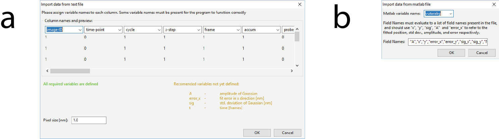
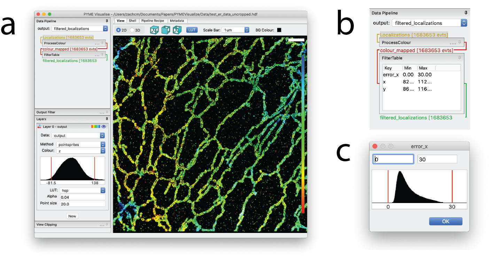

Data exploration
----------------

.. _sec_import:

Importing data
##############

PYMEVisualize is designed to work with localisation data in the formats .h5r/.hdf, .txt/.csv, and .mat. If a user
has raw single molecule localisation microscopy frames, they should first process these images using one of PYME's
`localisation fitting routines <https://python-microscopy.org/doc/LocalisationAnalysis.html>`__ or the program
of their choice.

Localisation data can be opened using the :menuselection:`File-->Open` menu command after launching PYMEVisualize, or by specifying the filename on
the command line (e.g. :command:`PYMEVis C:\\path\\to\\file.h5r`) [#fileassoc]_ .

Three data formats are currently supported for localisation data: HDF5 (**.h5r**/**.hdf**), delimited text **.txt/.csv**,
and matlab **.mat** files. In each case, the data should take the form of a table of values where each row corresponds
to a detected single molecule event and each column corresponds to a parameter. The .txt/.csv
and .mat importers are flexible and support a variety of different column layouts, with the only hard requirements being
that there are columns ``x`` and ``y`` for the position of a molecule and that all columns have equal lengths. Files may contain
as many other columns as they like, and columns can be in any order.  To take full advantage of PYMEVisualise, the
following parameters should also be included: the time/frame number at which the event was detected, the event amplitude,
event width, and the estimated localisation error, accessed through the column names ``t``, ``A``, ``sig``,
and ``error_x``, respectively.

.h5r/.hdf formats
+++++++++++++++++

The .h5r format is a custom format based on top of HDF5 and used by the analysis components of PYME to save
localisation results and metadata. It has fixed table and column names and everything needed is read automatically from
the file.  It is significantly faster to read and has a smaller file size than .mat and .txt/.csv

The .hdf format is a slightly more generic HDF5 based format which has more freedom with how data is arranged within the
HDF5 container. This is a good target for programs wishing to save data for use in PYME and avoid the performance issues
inherent in saving as .txt.

.. _sec_csv:

Delimiter separated text (.txt/.csv)
++++++++++++++++++++++++++++++++++++

PYME supports both tab and comma delimited text files using the .txt and .csv extensions, respectively. In both cases,
the column names are defined using an import dialog (:numref:`fig_import` a). It is possible to pre-populate the column names
to speed up the process by adding a python style comment (signified by a leading ``#``) to the first line of the file
containing a list of delimiter separated column names. The dialog will still be shown for confirmation, but the correct
column names should already be entered.

Matlab .mat files
+++++++++++++++++

We support MATLAB files in two formats: each column stored as a separate variable in the .mat file, or all columns in a
single variable (2D array). The first format is preferred. If the variable names in the .mat file correspond to the
standard variable names (``x``, ``y``, ``z``, etc …) described in :ref:`sec_import`, .mat files will open automatically. Alternatively,
an import dialog (:numref:`fig_import` a) will allow mapping of column names upon import, as described in :ref:`sec_csv`.
If the .mat file contains a single array, the import dialog (:numref:`fig_import` b) is a little more primitive, but the
same principle applies: each column needs to be given a name, and the parameters ``x`` and ``y`` must be defined. The names
are specified by typing a comma separated list of parameters into the supplied box. Each of the parameters must be
enclosed in double quotes, and there must be exactly the same number of parameters as there are columns in the 2D MATLAB array.

    Import dialog boxes for .txt/.csv and .mat file. (a) The dialog box that pops up when opening a text (.txt) or
    comma-separated value (.csv) file or a multi-column MATLAB (.mat) file. It lists a guess for each parameter name and
    the first ten values in that column. Columns can be renamed to match the recommended parameters not yet defined
    (yellow). The green text on the left indicates that required parameters (``x`` and ``y``) have been defined. (b)
    The dialog box that pops up when opening a single-array MATLAB (.mat) file. The name of the 2D MATLAB array containing
    localisation data is specified in the :guilabel:`Matlab variable name` box, and parameter names for each column 
    within that array are specified by typing a comma-separated list of parameters into the :guilabel:`Field Names` box.

.. _sec_metadata:

Metadata
++++++++

Acquisition metadata describing camera properties, localization routines, etc., can be important for quality control
and analysis. Metadata is automatically loaded from .hdf/.h5r files, and improved metadata handling for other file
formats is on our TODO list. In the meantime, missing metadata can be supplied by the user
in the :guilabel:`Shell` tab of PYMEVisualize (see :ref:`sec_shell`). For example, estimation of dye :ref:`photophysics <sec_photophysics>` requires the
``Camera.CycleTime`` metadata entry  (see :ref:`sec_photophysics`). To set ``Camera.CycleTime`` to 100
milliseconds, enter ``pipeline.mdh['Camera.CycleTime'] = 0.100`` into the shell. For more information on metadata, see
`http://python-microscopy.org/doc/metadata.html <http://python-microscopy.org/doc/metadata.html>`__.

    The PYMEVisualize GUI with a loaded data set. (a) Interactive display of ~1.7
    million data points from a super-resolution image of the endoplasmic reticulum in a U2OS cell, courtesy of
    Yongdeng Zhang and Lena Schroeder. (b) The expanded filter for this image. (c) An example editing dialog for the ``error_x`` filter.

Having successfully loaded a dataset, the window should resemble :numref:`fig_explore` a. If nothing is displayed, don’t
panic: the most common reason is that the filter (see :ref:`sec_filter` section below) is throwing away all the data points.

.. _sec_pipeline:

The data pipeline
#################

Data loaded into PYMEVisualise is processed using a configurable pipeline, accessed in the PYMEVisualize graphical user
interface under the :guilabel:`Data Pipeline` tab (see :numref:`fig_explore` b for an example). By default, the pipeline loads with
two sections, ``ProcessColour`` which extract and process colour information, if present in the input, and  ``FilterTable``
which filters on localization precision etc … Expanding portions of the pipeline, such as :guilabel:`FilterTable` (see
:numref:`fig_explore` b, and the section below), allows for direct manipulation of their settings. Many of the
additional manipulations accessible from the menus, such as drift correction and repeated localization chaining, will add
steps to this pipeline. The parameters of these steps are then adjustable and will update the output in real-time. The
entire pipeline can also be saved and re-loaded at a later date.

.. _sec_filter:

The filter
++++++++++

The filter (:numref:`fig_explore` b) restricts analysis and visualization to a subset of the data source. It allows
specification of a valid range for each parameter, and points with parameters in these ranges are kept. The filter is
used to discard erroneous events where, for example, the localization fit yielding the point picked up a noise spike or
did not converge.

The filter is controlled from within the data pipeline in the sidebar, and can be expanded by clicking on :guilabel:`FilterTable`.
Right clicking in the table gives you the option to add and, if a parameter is selected, edit or delete a parameter.
Double-clicking on a parameter also enables editing. Editing parameters brings up a dialog, as shown for the ``error_x``
parameter in :numref:`fig_explore` c. A histogram of the selected parameter is displayed and the current bounds are
indicated by red vertical lines. These lines can be dragged with the mouse to change the filter bounds. The filter
editor (and all other histogram editors) also understand the following keys if they have focus (i.e. if the user clicks on the histogram).

+----------+----------------------------------------------------------------------+
+ :kbd:`m` + sets the bounds to the minimum and maximum values of the variable    +
+----------+----------------------------------------------------------------------+
+ :kbd:`p` + sets the bounds to the 1st and 99th percentiles                      +
+----------+----------------------------------------------------------------------+
+ :kbd:`l` + toggles log scaling on y-axis                                        +
+----------+----------------------------------------------------------------------+

The text editing boxes above the histogram can also be used to update parameter bounds. The filter will typically come
with default bounds for ``A`` (the point amplitude), ``sig`` (the standard deviation of
the fitted Gaussian), and ``error_x`` (the estimated error in the x position). The default values in PYMEVisualize are for
imaging at ~647 nm excitation with a 1.47NA objective, and quite likely need changing. Notably, ``A`` will need to be
changed for different intensity calibrations, and ``sig`` will need to be changed when working at different wavelengths.

Colour channels
###############

PYMEVisualise uses a probabilistic mechanism of channel assignment through which each fluorophore is given a probability
of belonging to each of the colour channels present in the sample. Initially designed to support ratiometric imaging
where colour assignments are not absolute, it is a flexible model which can also support simpler scenarios where
channels are well separated or imaged sequentially. Colour assignment is performed by the ``ProcessColour`` pipeline
module and three different methods of assigning colour probabilities are available: Bayesian channel assignment for
ratiometric localisation data, temporal assignment for sequentially localised fluorophores, and pre-assignment using a
``probe`` column for imported data where channel assignment has already been performed. The method of colour assignment
will be chosen automatically based on the file metadata and the presence of columns named either ``probe``
(pre-assigned), or ``gFrac`` [#gfrac]_ (ratiometric).  Under the hood, these all feed into the probabilistic colour model resulting in special
``p_<channel_name>``  columns. If multiple color channels are detected, PYMEVisualize will automatically generate layers
(see :ref:`sec_display`) for each color channel when the file is loaded, in addition to the standard layer showing all points.
See :ref:`sec_ratiometric` and :ref:`sec_colour_isolation` for details on ratiometric colour processing and channel
extraction for non-colour aware processing routines.

ROI selection / the "Output Filter"
###################################

The "Output Filter" [#outputfilt]_ is located immediately below the data pipeline. It is
similar to the filter within the pipeline, but operates after all other processing steps and immediately before display.
Its primary use is for cropping the data to a smaller spatial ROI by adding filters on the ``x`` and ``y`` parameters.
Rather than manually creating and setting these filters, a selection can be made by clicking and dragging with the left
mouse button within the view tab (a yellow selection rectangle should be shown), and then clicking on :guilabel:`Clip to Selection`
in the :guilabel:`Output Filter` pane (or pressing :kbd:`F8`). The ROI can then be cleared by clicking the same button
(or by pressing :kbd:`F8` again).

.. _sec_display:

Interactive display
###################

The processing pipeline feeds into the interactive display (:numref:`fig_explore` a). By default the display shows a
single **"Points"** layer which renders the processed localisations as a point cloud. Points layers (see, e.g.
:numref:`fig_explore` a) support a number of different display modes, from simple dots, through shaded spheres, to
transparent Gaussians (point sprites), which provide a real-time approximation to the popular Gaussian reconstruction
mode. Points can be coloured by any of the fitted parameters (via the :guilabel:`Colour` dropdown), with a variety of
different look up tables (:guilabel:`LUT`) and with adjustable size and transparency.  Extra layers can be added to
simultaneously visualise different steps in the processing pipeline, colour channels, or data types. In addition to the
**Points** data type, there are layers for rendering triangular meshes/surfaces, octrees, single particle tracks and 
voxel-based image data.

The display can be zoomed in and out using the mouse wheel, and panned by dragging with the right mouse button.
Choosing :menuselection:`View-->Fit` from the menu will reset the display such that the whole
data set fits within the display window. Pressing :kbd:`C` recenters the data bounding box on the current view. 
A scale bar and color lookup table are on the right of the display window.

.. [#gfrac] Corresponding to the ratio of short channel to total intensity for a single event.

.. [#fileassoc] You can also associate PYMEVisualise with a particular file type by using the "Open With" command in
        the windows explorer and locating the PYMEVis.exe (under ``Scripts`` in the directory you installed PYME to).

.. [#outputfilt] This name is historical, and refers to a time when this was the only filter in the workflow. It will probably be renamed to ROI at some point in the future.
