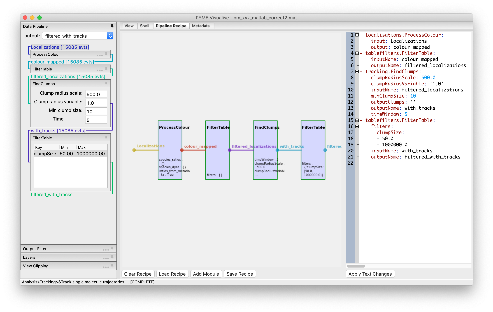

.. _sec_recipe_editor:

Editing the pipeline "recipe"
-----------------------------

As mentioned in :ref:`sec_pipeline`, data flows through a configurable pipeline. When constructing a complex workflow
(e.g. processing different colour channels in different ways - see :ref:`sec_colour_isolation`) it can be useful to edit
this pipeline directly using the recipe editor (:numref:`fig_recipe_editor`), accessible via the :guilabel:`Pipeline Recipe`
tab. This also lets you access additional functionality such as feature based tracking, which is not currently accessible
through the menus. The pipeline is specified by a recipe (a .json textual description) which describes the various
processing steps to be applied. The recipe can be modified, either graphically or as text, saved and reloaded on a new
dataset, or applied to multiple input files in a batch using the ``bakeshop`` utility. 

    The pipeline as seen in the recipe editor. Custom workflows can be created by manually adding processing modules.