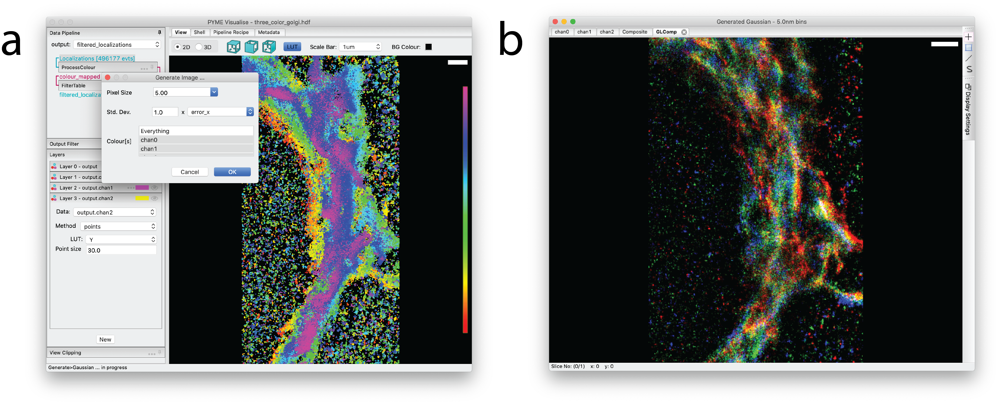

.. _sec_rendering:

Image Reconstruction
--------------------

In many cases it is desirable to reconstruct a density image analogous to a more conventional voxel based dataset such
as would be acquired by confocal microscopy. PYMEVisualise supports a number of different image reconstruction
algorithms, which can be found under the :menuselection:`Generate` menu. The following methods are supported.

:Histogram: A histogram of localisation positions with a specified bin size. The simplest possible reconstruction technique.

:Gaussian: The popular reconstruction method which creates a density image by summing Gaussians at each localisation.
    By default, the estimated localisation error is used to determine the width of the Gaussians (as introduced in [betzig2006]_),
    but any of the fitted parameters can be used. Using the fitted event width (``sig``) instead is a simple way of generating
    synthetic diffraction limited images.

:Jittered triangulation: Described in [baddeley2010]_, the jittered triangulation method performs a local density estimate
    based on a Delaunay-triangulation of the localisation data. When compared to Gaussian rendering it gives less weight
    to stochastic features resulting from only a few localisations and generally gives better quality segmentations when
    thresholded in subsequent processing. In the limit of high emitter density, it also gives better resolution (although
    practical emitter densities are seldom high enough for this to be relevant).

    The variable which dictates the jitter magnitude can be selected, and defaults to a measure of the distance between a
    point and its neighbours. The number of samples to average defaults to 10.

    In addition to jittering, it is also possible to smooth the triangulation by averaging several triangulations performed
    on Monte-Carlo subsets of the point positions. To try this out, set the multiplier for the jitter to 0 and set the MC
    subsampling probability to less than 1 (~ 0.2 is probably a good start).

:Quadtree: Also described in [baddeley2010]_, the quadtree method renders a quadtree where the intensity of each leaf of
    the tree is proportional to the density of points within that leaf, dividing bins when the number of localisations
    contained is greater than the :guilabel:`Max leaf size` parameter. This leads to adaptive bin sizing where areas of
    the image that are localisation poor have large bins and localisation dense regions have small bins. A convenient way
    to think of the quadtree method is that it yields an approximately constant signal to noise (of
    :math:`\sim \sqrt{\frac{max\_leaf\_size}{2}}`) across the image regardless of local point density. Like the jittered triangulation
    method, it helps avoid some of the visual and segmentation artifacts obtained using the Gaussian method when sampling
    density is low.

3D versions of the histogram, Gaussian, and Jittered Tirangulation methods are also available. These generate a volumetric
stack rather than a 2D image.

After an image is generated, it will pop up in
a new window (:numref:`fig_render` b). Colour scaling in the viewer can be adjusted by expanding the
:guilabel:`Display Settings` tab to the right of the image. When viewing multi-colour images, individual channels will
appear in separate tabs, along with a composite tab in which the channels are overlaid. Generated images may be saved as
raw values (:menuselection:`File-->Save as`) suitable for quantitative analysis in downstream software, or exported as
scaled and colour-mapped snapshots (:menuselection:`View-->Export Current View`) for inclusion in presentations or
publications. The default formats are floating point TIFF for raw data and PNG for snapshots.

.. note::

    Some versions of ImageJ/FIJI do not load floating point TIFF (and therefore our exported images) correctly,
    although the Bio-Formats importer does. If an exported .tif looks weird in ImageJ, try opening with the Bio-Formats importer.

    2D Gaussian rendering of a 3-color super-resolution image of *cis*, *medial*, and *trans*-Gogli. (a) A
    :guilabel:`Generate Image…` dialog specifying a pixel size of 5 nm, a standard deviation of ``error_x`` nm for each rendered
    Gaussian, and a request for renderings of all 3 colour channels. (b) An image viewer displaying a composite of the
    rendered colour channels. Individual channels are accessible via tabs (``chan0``, ``chan1``, ``chan2``) in the image viewer. 
    Clicking on `Display Settings` will reveal a histogram that can be used to adjust colour channel contrast, among other display tools.

.. [baddeley2010] D. Baddeley, M. B. Cannell, and C. Soeller, "Visualization of localization microscopy data," Microsc. Microanal., vol. 16, no. 1, pp. 64–72, 2010.

.. [betzig2006] E. Betzig et al., "Imaging intracellular fluorescent proteins at nanometer resolution," Science (80-. )., vol. 313, no. 5793, pp. 1642–1645, 2006.
