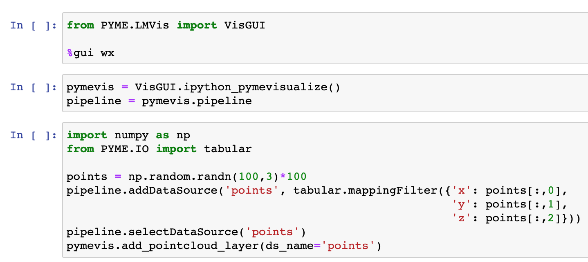

Programmatic usage
------------------

.. _sec_shell:

Shell
#####

The :guilabel:`Shell` tab is a functional Python command line embedded within the program. The pipeline can be accessed directly
from the shell, and behaves like a dictionary keyed by variable names. Pylab is imported in the shell making a number of
MATLAB-style plotting and basic numeric commands accessible (see the matplotlib webpage for more docs).
One can, for example, plot a histogram of point amplitudes by executing ``hist(pipeline['A'])``.
Pipeline data sources can be accessed by entering ``pipeline.dataSources[datasource_key]``. For a list of datasource keys, type ``pipeline.dataSources``.

Jupyter notebook
################

PYMEVisualize can be used directly from a Jupyter notebook. At the top of the notebook, enter
``from PYME.LMVis import VisGUI``, ``%gui wx``, and then ``pymevis = VisGUI.ipython_pymevisualize()``. This makes it possible to
access a PYMEVisualize instance from a notebook through the ``pymevis`` variable. Setting ``pipeline=pymevis.pipeline``
gives the user access to the PYMEVisualize pipeline in exactly the same way as described in :ref:`sec_shell` section.
An example of generating a point cloud, passing it to a tabular data source, and visualizing
the data source is shown in :numref:`fig_notebook`.

    An example of generating a point cloud, passing it to a tabular data source, and visualizing the data source in PYMEVisualize from a Jupyter notebook.

Please note that both PYME and the Jupyter kernel must be set up in the Framework build on a Mac
(see `https://python-microscopy.org/doc/Installation/InstallationFromSource.html <https://python-microscopy.org/doc/Installation/InstallationFromSource.html#installationfromsource>`__) for this to work.
To install the Jupyter kernel in the Framework build, activate ``your_pyme_environment`` and then type ``PATH/TO/CONDA/ENVIRONMENT/python.app/Contents/MacOS/python -m ipykernel install --user --name your_pyme_environment``.

Plugins
#######

Details on extending and writing plugins for PYMEVisualize are available at
`http://python-microscopy.org/doc/hacking.html <http://python-microscopy.org/doc/hacking.html>`__. A template for
extending PYMEVisualize can be found at `https://github.com/python-microscopy/pyme-plugin <https://github.com/python-microscopy/pyme-plugin>`__.
