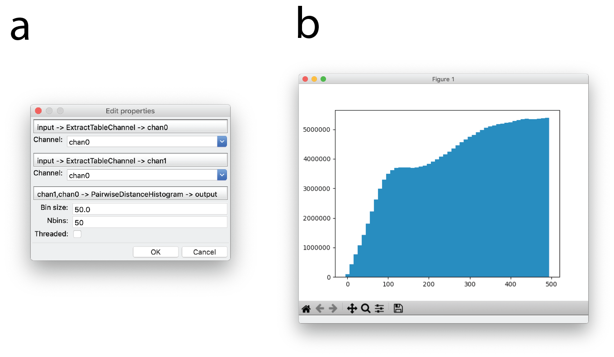
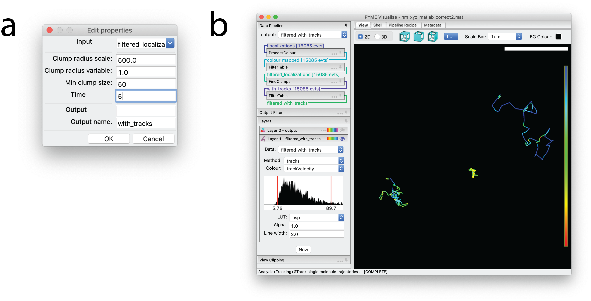

Quantification
--------------

PYMEVisualise includes several quantitative analysis routines, operating both directly on localisation data and on
reconstructed images. An incomplete description of some of the most well used options is given below.

.. _sec_pairwise:

Pairwise distances
##################

Pairwise distance histograms are a powerful metric calculated directly from the point data set without the need for reconstruction.
They measure the distribution of distances from each point to every other point and can be used for cluster analysis,
either through the raw pairwise distance histogram (:menuselection:`Analysis-->Clustering-->Pairwise Distance Histogram`)
or using derived measures such as Ripleys K & L functions (:menuselection:`Analysis-->Clustering-->Ripley's K/L`) [kiskowski2009]_, [nicovich2017]_.
When applied between two colour channels, they provide a co-localisation (or co-clustering) measure
(:menuselection:`Analysis-->Pointwise colocalisation`) [coltharp2014]_.
It is also possible to infer some shape features from the pairwise distance histogram [osada2002]_, [curd2020]_.

To the best of our knowledge, the algorithms used for calculating pairwise distances histograms in PYMEVisualise are
significantly more efficient than existing published options. This is achieved by calculating the histogram on the fly
and never storing the full pairwise distance matrix. To give a rough idea, we are 20x faster than the already optimised
``numpy.histogram(scipy.spatial.pdist(...))`` (or equivalent MATLAB calls). We also use several orders of magnitude less
memory (memory demand scales as :math:`O(N)` rather than :math:`O(N^2)` as for ``pdist()``) meaning that we can feasibly
compute pairwise distance histograms from much larger datasets (100k points requires ~1.6MB as opposed to ~1GB).

    Pairwise distance histograms. (a) Dialog for generating pairwise distance histograms. (b) Example pairwise distance
    histogram of sub-ROI of the image in :numref:`fig_explore` a with a bin size of 10 and 50 bins. Distance in nanometers
    is plotted on the x-axis and counts are plotted on the y-axis.

For completeness, it is also possible to calculate a histogram of nearest neighbour distances
(:menuselection:`Analysis-->Clustering-->Nearest Neighbor Distance Histogram`). Whilst somewhat easier to interpret, these
tend to be much more susceptible to noise than the full pairwise distance histogram so it is preferable to use the latter
where possible.

Single-molecule tracking
########################

PYMEVisualise offers a couple of particle tracking algorithms. The simplest option, suitable for well separated particles,
is accessed as follows. Open a dataset containing at least the variables ``x``, ``y``, and ``t`` (see :ref:`sec_import`). Navigate in the menu to
:menuselection:`Analysis-->Tracking-->Track single molecule trajectories`. A dialog box will pop up as shown in :numref:`fig_tracking` a.
The maximum distance between two consecutive points which will still be connected as a track is given by ``ClumpRadiusScale*ClumpRadiusVariable``
where ``ClumpRadiusVariable`` can be any of the fitted parameters/columns or a constant. For particle tracking it makes sense
to leave this at it's default of a constant 1 nm and just alter ``ClumpRadiusScale``. ``ClumpRadiusScale`` should be set to a value
that is greater than the maximum distance a particle is expected to move within one frame [#trackingscale]_, but less than the distance between separate particles.
``Min clump size`` refers to the minimum number of points that need to be
in a track. ``Time window`` is the maximum distance in time between any two consecutive points in a track. Once tracked,
the trajectories will display in a tracks layer (see :ref:`sec_display`) as in :numref:`fig_tracking` b. Tracks can be optionally colored and/or
filtered by variables from the original dataset, by track unique identifier, by track length, and by instantaneous velocity.
A slightly more sophisticated tracking algorithm, suitable for denser tracking scenarios, which can use the z-position
along with additional features such as particle brightness and shape to improve linkages is available by manually adding
the ``TrackFeatures`` module to the pipeline (see :ref:`sec_recipe_editor`).

    Tracking Rtn4-SNAP in 2D. (a) Dialog window indicating settings for particle tracking. (b) The
    resulting trajectories, displayed with constant coloring. The particles giving rise to these trajectories are
    visible as points in Layer 0, which is hidden in this example, as indicated by the transparent eye.

Other algorithms
################

:QPAINT: Algorithms for ploting and fitting off-time distributions for QPAINT ([jungmann2016]_)

:Chromatic shift calibration: A couple of algorithms (:menuselection:`Corrections-->Shiftmaps-->XXX`) for calibrating
    chromatic shifts between colour channels from bead datasets. Mostly used with ratiometric localisation analysis.

:Vibration characterisation: Accessed as :menuselection:`Extras-->Diagnostics-->Plot vibration spectra`, this looks for
    signatures of instrument vibration in a (rapidly acquired) bead localisation series.

.. [coltharp2014] C. Coltharp, X. Yang, and J. Xiao, "Quantitative analysis of single-molecule superresolution images," Curr. Opin. Struct. Biol., vol. 28, no. 1, pp. 112–121, 2014.

.. [osada2002] R. Osada, T. Funkhouser, B. Chazelle, and D. Dobkin, "Shape distributions," ACM Trans. Graph., vol. 21, no. 4, pp. 807–832, 2002.

.. [curd2020] A. Curd et al., "Nanoscale pattern extraction from relative positions of sparse 3D localisations," bioRxiv. 2020.

.. [kiskowski2009] M. A. Kiskowski, J. F. Hancock, and A. K. Kenworthy, "On the use of Ripley’s K-function and its derivatives to analyze domain size," Biophys. J., vol. 97, no. 4, pp. 1095–1103, 2009.

.. [nicovich2017] P. R. Nicovich, D. M. Owen, and K. Gaus, "Turning single-molecule localization microscopy into a quantitative bioanalytical tool," Nat. Protoc., vol. 12, no. 3, pp. 453–461, 2017.

.. [#trackingscale] Or twice the localisation precision if the molecules are super slow moving and their expected motion is less than this.

.. [jungmann2016] R. Jungman et al., "Quantitative super-resolution imaging with qPAINT", Nat. Methods, vol. 12, no. 5, pp. 439-442, 2016.
