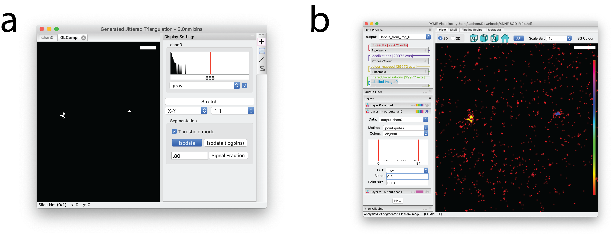
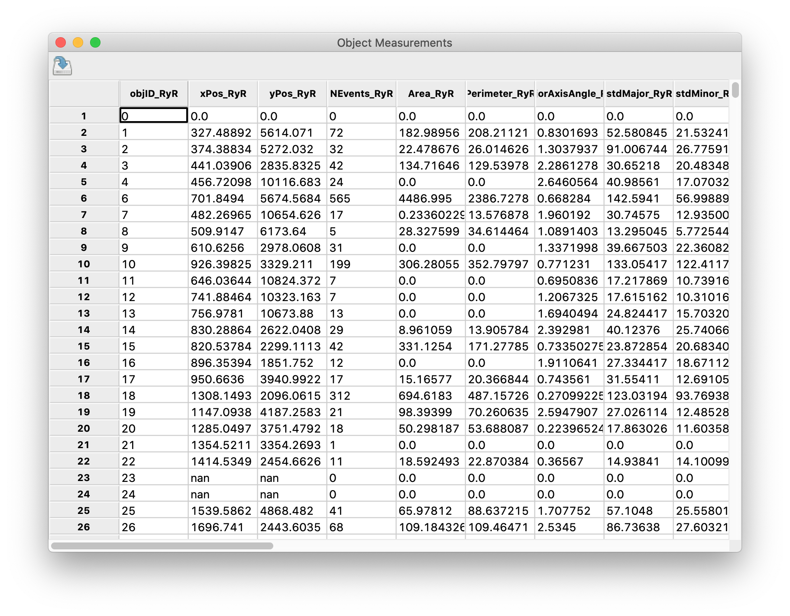

Segmentation and clustering
---------------------------

Although the presence of clusters and average cluster sizes can be deduced directly from point distance distributions
(see :ref:`sec_pairwise`), some form of segmentation is needed when quantifying the properties of individual clusters.
PYMEVis offers a number of options here.

.. _sec_voxel_segmentation:

Voxel-based
###########

PYMEVisualise's :ref:`sec_rendering` provides several density image representations that can be thresholded for
density-based segmentation. One of the main advantages to this approach is that there is a very large body of existing
work in the literature on how to set reasonable thresholds for voxel-based images (e.g. isodata, Otsu) and their
limitations are well-characterized. In our experience image based cluster segmentation, when combined with an
appropriate density reconstruction algorithm, performs as well as or better than more direct methods such as DBSCAN.
It is also by far the simplest way to segment multi-channel data. Once thresholded, the segmentation assignments from
the images can be propagated back to the point data.

To threshold a reconstructed image, expand :guilabel:`Display Settings`, select :guilabel:`Threshold mode` 
and press :guilabel:`Isodata` in the resulting window (:numref:`fig_threshold` a). For smoother blobs, 
it can help to run :menuselection:`Processing-->Gaussian Filter` prior to entering threshold mode.

Once the voxel-based image is thresholded, select :menuselection:`Processing-->Label` and enter the minimum 
number of pixels a blob must contain to qualify as a cluster in the dialog window that pops up. 
A new window named :guilabel:`Labeled Image` will appear in which each connected region is assigned a unique integer "label". 
Return to the main PYMEVisualise window and select :menuselection:`Analysis-->Get segmented IDs from image` 
and choose the labeled image. Recolour by :guilabel:`objectID` to see the segmented points (:numref:`fig_threshold` b).
The ``labeled`` LUT works quite well for displaying clusters.

    Voxel-based segmentation in PYMEVisualize. (a) A variant of :numref:`fig_render` b with 
    :guilabel:`Display Settings` expanded to allow for thresholding. (b) Original point data colored by 
    :guilabel:`objectID`.

Tessellation-based
##################

An attractive method of density reconstruction which gives high-quality segmentations is to use a tessellation of the point
data ([baddeley2010]_, [levet2015]_). Although one can segment such tessellations directly, our preferred option
is to generate a voxel-based density image from the tessellation and then segment this image (see :ref:`sec_voxel_based`).
This is mathematically equivalent, but a little more flexible than the direct method - particularly when it comes to the
choice of thresholding algorithm and application to multi-channel data. In PYMEVis this is performed by running
:menuselection:`Generate-->Jittered Triangulation`, or :menuselection:`Generate-->Jittered 3D Triangulation`, and then
proceeding as described above.

DBSCAN
######

If a user prefers to cluster directly on points, an implementation of DBSCAN clustering 
([ester1996]_, [nicovich2017]_) is available by selecting :menuselection:`Analysis-->Clustering-->DBSCAN Clump` 
from the menu. To see the segmentation, recolour by :guilabel:`dbscanClumpID`.

.. note::

    DBSCAN relies on single linkages/edge length between points, which makes the algorithm sensitive to noise. It tends
    to perform less well than the voxel-based segmentation when there is high background.

Exporting object measurements
#############################

It is possible to export object measurements to HDF or CSV file, which can then be further analyzed in a Jupyter notebook,
Excel, etc. To do this, navigate to :menuselection:`Analysis-->Measure objects`. A tabular viewing window will appear, as
shown in :numref:`fig_tabular`. Click on the disk drive icon in the upper left of the window to save the results to file.

    Tabular viewing window.

.. [nicovich2017] P. R. Nicovich, D. M. Owen, and K. Gaus, "Turning single-molecule localization microscopy into a quantitative bioanalytical tool," Nat. Protoc., vol. 12, no. 3, pp. 453–461, 2017.

.. [ester1996] M. Ester, H.-P. Kriegel, J. Sander, and X. Xu, "A density-based algorithm for discovering clusters in large spatial databases with noise," Proceedings Second Int. Conf. Knowl. Discov. Data Min., pp. 226–231, 1996.

.. [baddeley2010] D. Baddeley, M. B. Cannell, and C. Soeller, "Visualization of localization microscopy data," Microsc. Microanal., vol. 16, no. 1, pp. 64–72, 2010.

.. [levet2015] F. Levet et al., "SR-Tesseler: A method to segment and quantify localization-based super-resolution microscopy data," Nat. Methods, vol. 12, no. 11, pp. 1065–1071, 2015.
