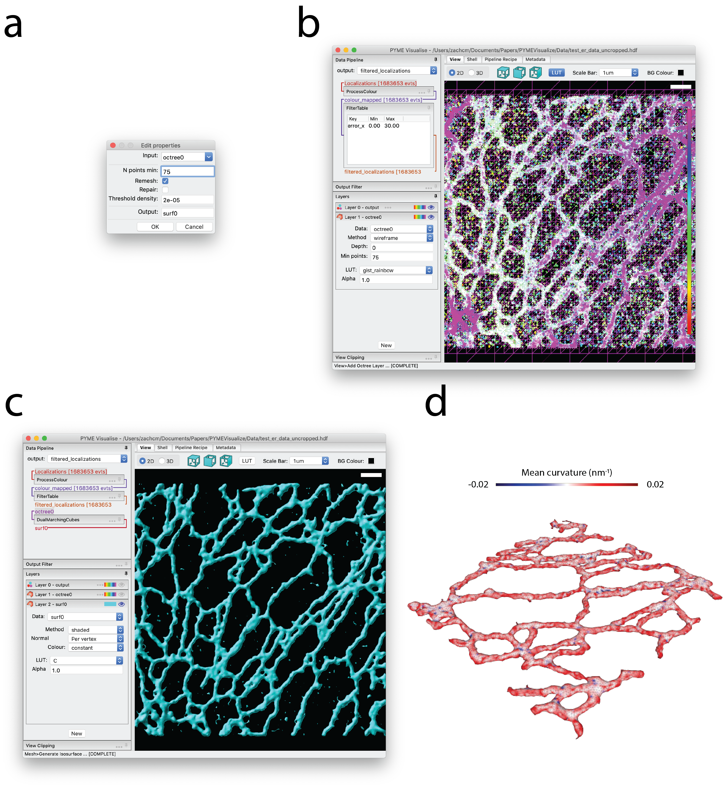
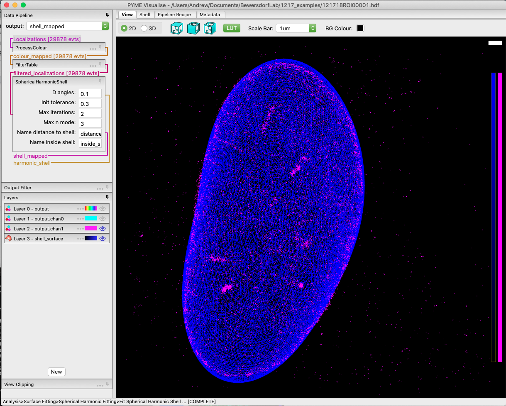

Surface extraction
------------------

.. _sec_isosurfaces:

Isosurfaces
###########

Isosurfaces are a common tool for visualising volumetric voxel data sets such as those produced by confocal microscopy.
The algorithms and software tools used to generate isosurfaces for confocal can be applied to super-resolution images after performing a 3D density reconstruction
(see :ref:`sec_rendering`). This indirect approach, however, has a number of disadvantages. To capture detail
in the data sets generally requires the use of a small reconstruction voxel size, resulting in exceptionally large datasets.
A 10x10x10 µm super-resolved volume with a 5 nm pixel size would give rise to an 8 gigavoxel (32 GB) reconstructed volume.
This represents a major computational challenge, in practice limiting such reconstructions to small ROIs and often
smoothed and downsampled data. A second limitation is the need to choose this voxel size in advance. Due to the stochastic
nature of localisation microscopy, choosing an appropriate reconstruction voxel size is not a trivial problem - different
parts of the image could well have a different optimal voxel size.

In PYMEVisualise we have implemented algorithm which permits isosurfaces to be extracted much more efficiently from point
datasets without a conventional image intermediate. Our algorithm initially places points into an octree
data structure [meagher1980]_ (:numref:`fig_octree` b). We then cut / truncate the octree at a given minimum number of localisations per octree cell (equivalent to
a minimum signal to noise ratio (SNR) - see [baddeley2010]_). This has the effect of dividing the volume into cubic cells with a size which adapts
to the local point density. Cells will be large in areas with few localisations, and small in areas which are localisation
dense. The result is a volumetric data structure that contains the same information as a fully sampled reconstruction but
with a lot less elements. We calculate a local density of localisations in each cell and then run the Dual Marching Cubes
([schaefer2005]_) algorithm on this with a given density threshold (:numref:`fig_octree` c).

.. figure:: images/image_octree.png
    :name: fig_octree

    Octree generation. (a) The 3D dataset from :numref:`fig_explore` requires 900 megavoxels to sample at 5 nm intervals. 
    To reduce memory use, we sample with a sparse octree. (b) Birds-eye view of an octree used to
    generate an isosurface, overlaid on a subregion of the dataset shown in :numref:`fig_explore` a. (c) A birds-eye view of
    a dual grid used to generate an isosurface, overlaid on a subregion of the dataset shown in :numref:`fig_explore` a. Each
    vertex of the dual grid the center of an octree leaf.

The algorithm for isosurface generation is accessible from the menu as :menuselection:`Mesh-->Generate Isosurface`. This
will construct the octree over which the isosurface is calculated and then display a dialog (:numref:`fig_isosurface` a)
allowing parameters of the isosurface generation to be adjusted. The parameters are as follows:

.. py:class:: DualMarchingCubes
    :noindex:
    
    :param Input: the octree name (do not modify)
    :param NPointsMin: the leaf size (number of localisations) at which we truncate the octree. A higher value increases the
        SNR at the expense of resolution.
    :param ThresholdDensity: the threshold on density (in localisations/nm^3) at which to construct the isosurface.
    :param Remesh: improves mesh quality by subdividing and merging triangles such that triangles are more regularly sized
        and the number of connections at each vertex is more consistent. This improves both appearance and the reliability
        of numerical calculations on the mesh (e.g. curvature and vertex normals). Disable when experimenting with
        thresholds to improve performance.
    :param Repair: will patch holes in the mesh (usually not needed).

    Isosurface generation. (a) Dialog box for isosurface generation. (b) Birds-eye view of the octree layer used to
    generate isosurface, overlaid on the original dataset shown in :numref:`fig_explore` a. (c) Birds-eye view of
    the generated isosurface. (d) Middle portion of the isosurface in c, colored by mean curvature and rotated for perspective.

Spherical harmonics
###################

Another method of surface extraction from point data sets is to fit spherical harmonics
(:menuselection:`Analysis-->Surface Fitting-->Spherical Harmonic Fitting-->Fit Spherical Harmonic Shell`). In contrast
to the isosurface method (which simply thresholds on density) spherical harmonic fitting assumes that points lie on a
surface. Because it is model based it is much better constrained and can extract accurate surfaces from significantly
sparser datasets. It is ideally suited to the extraction of the cell nuclear envelope based on a lamin or NPC staining, but is also
applicable to other "blobby" structures which are shell-labelled [singh2011]_. When multiple objects are present in a field of view,
these will need to be segmented first. 

    Data from [barentine2019]_.

Mesh manipulation
#################

A number of operations are possible on meshes generated using either isosurfaces or spherical harmonics. These meshes can
be colored by variables, such as ``x``, ``y``, ``z``, and curvature, as in :numref:`fig_isosurface` d. Meshes can be
exported to STL or PLY format, suitable for importing in other software or 3D-printing. There are also a growing number
of analysis options (e.g. :menuselection:`Mesh-->Analysis-->Distance to mesh` which calculates the signed distance between
localisations and the mesh) which operate on the meshes.

.. [meagher1980] D. Meagher, "Octree Encoding: A New Technique for the Representation, Manipulation and Display of Arbitrary 3-D Objects by Computer," Rensselaer Polytech. Inst., no. Technical Report IPL-TR-80-111, 1980.

.. [baddeley2010] D. Baddeley, M. B. Cannell, and C. Soeller, "Visualization of localization microscopy data," Microsc. Microanal., vol. 16, no. 1, pp. 64–72, 2010.

.. [schaefer2005] S. Schaefer and J. Warren, "Dual marching cubes: Primal contouring of dual grids," Comput. Graph. Forum, vol. 24, no. 2, pp. 195–201, 2005.

.. [singh2011] S. Singh et al., "Non-parametric Population Analysis of Cellular Phenotypes," Med Image Comput Comput Assist Interv., vol. 14, no. 2, pp. 343–351, 2011.

.. [barentine2019] A. E. S. Barentine et al., "3D Multicolor Nanoscopy at 10,000 Cells a Day," bioRxiv, 2019.
