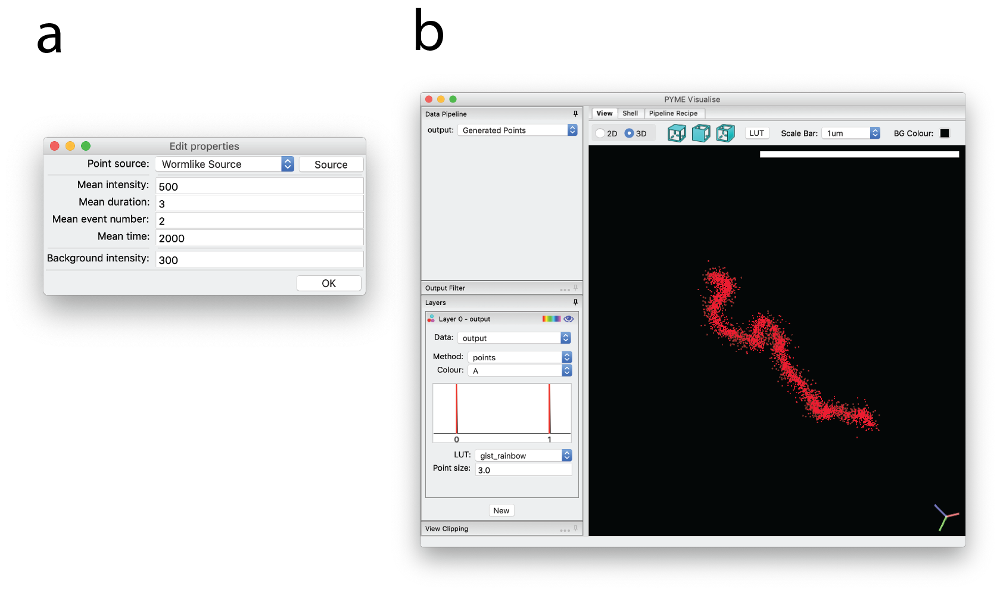

Synthetic data
--------------

For testing purposes, it can be helpful to generate synthetic data. PYMEVisualize lets users generate synthetic data
using a simulated worm-like chain model (with the right settings this can produce reasonable analogues of a wide range of
filamenteous structures from microtubules to tightly folded DNA), from an image, or from a text file containing a list of coordinates.
First select :menuselection:`Extras-->Synthetic Data-->Configure` and choose the point generating source and
set properties associated with the source, as shown in :numref:`fig_synthetic` a. Then select
:menuselection:`Extras-->Synthetic Data-->Generate fluorophore positions and events`, and a simulated set of
localization events is generated, as shown in :numref:`fig_synthetic` b. This data can then be analyzed in the same way
that real data would be.

To simulate additional localizations from the same set of points, but using different simulation parameters, edit the
properties as in :numref:`fig_synthetic` a and then select :menuselection:`Extras-->Synthetic Data-->Generate events`.

    Generation of synthetic data. (a) Dialog box that appears after selecting
    :menuselection:`Extras-->Synthetic Data-->Configure`. (b) Example synthetic worm-like chain created using parameters
    from dialog box in a.